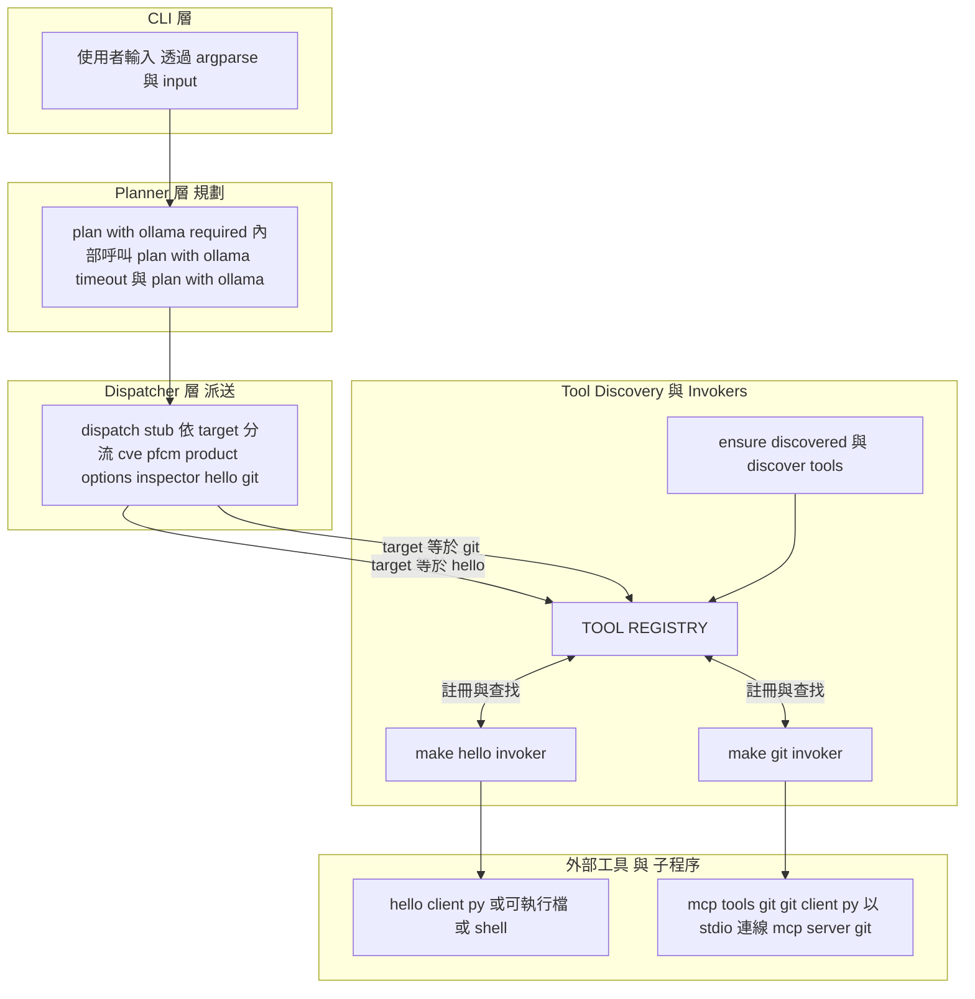
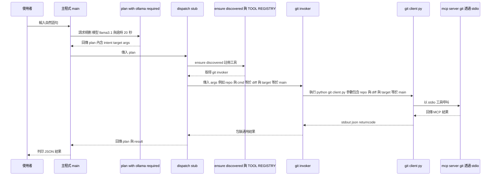
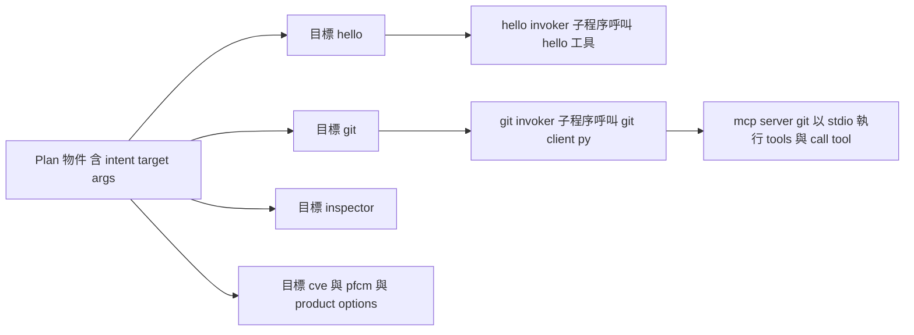

# MCP Host 架構圖與流程說明

本文件說明 `mcp_host.py` 的架構，並包含逐步解釋各個流程。

---

## 一 概觀與角色

- 這支程式是一個 **MCP Host**
- 工作流程是：把使用者自然語句 → 轉成 JSON 計畫 → 依 target 路由到對應工具
- 目前支援的主要工具是 **hello** 與 **git**
- **git invoker** 呼叫 `git_client.py`，再透過 stdio 連線到官方 `mcp-server-git`

---

## 二 元件架構圖



---

## 三 執行序列圖：以 git diff 為例



---

## 四 資料流與路由



---

## 五 逐步解釋流程

### 步驟 1 使用者啟動程式
- main 建立 argparse
- 檢查 ollama 是否可用
- 呼叫 ensure discovered 註冊工具

### 步驟 2 取得使用者輸入
- 讀取自然語句，例如「請幫我比較目前分支與 main 的差異」

### 步驟 3 產生計畫
- 呼叫 plan with ollama required
- 內部會呼叫 plan with ollama timeout 與 plan with ollama
- 傳給 ollama 一個 system 提示與 user 內容
- 嘗試解析為 JSON
- 若成功會輸出：
  ```json
  {
    "intent": "git_diff",
    "target": "git",
    "args": { "repo": ".", "cmd": "diff", "target": "main", "context_lines": 5 }
  }
  ```

### 步驟 4 派送與執行
- dispatch stub 根據 target 轉送
- hello → hello invoker
- git → git invoker
- 其他 → 示意輸出

### 步驟 5 hello invoker
- 搜尋 hello 工具可能的三種實作
- 執行並回傳 stdout 與 stderr 與 returncode 等資訊

### 步驟 6 git invoker
- 映射 args 成為子命令
- 執行 git client py
- git client py 啟動 mcp server git 並呼叫對應工具
- 收到結果後轉成 JSON 包裝回傳

### 步驟 7 結果輸出
- dispatch stub 將 plan 與 result 包成一個物件
- main 以縮排 JSON 印出

---

## 六 錯誤處理

- **Ollama 不存在**：立即報錯
- **規劃逾時**：回傳逾時錯誤
- **工具逾時**：invoker 回傳 timed out 為真
- **JSON 格式錯誤**：嘗試擷取大括號區段，失敗則拋出例外

---

## 七 擴充與重構建議

1. Planner 抽象化，支援不同規劃策略
2. Dispatcher 以註冊表管理 target 與 handler
3. Invoker 統一介面與回傳格式
4. Tool Discovery 插件化，支援工具描述檔
5. 強制結果格式一致，便於整合與測試

---