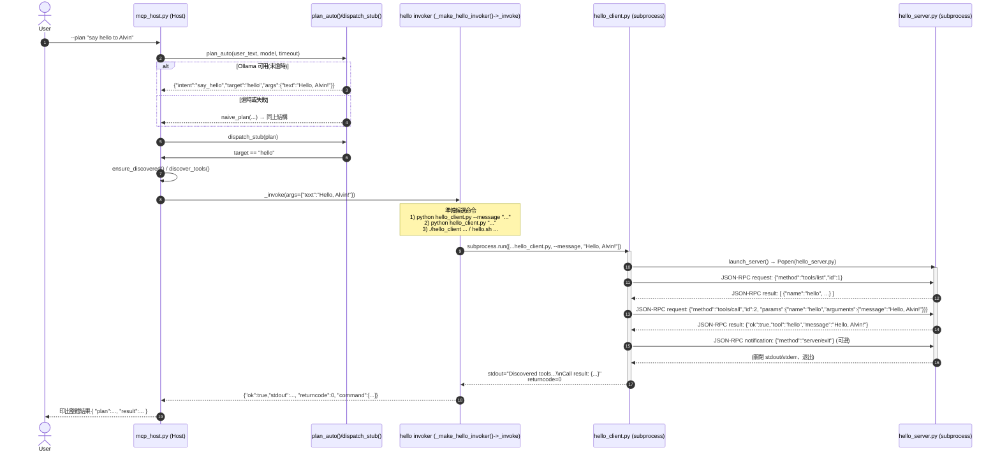

```mermaid
sequenceDiagram
    autonumber
    actor U as User
    participant H as mcp_host.py (Host)
    participant P as plan_auto()/dispatch_stub()
    participant I as hello invoker (_make_hello_invoker()->_invoke)
    participant C as hello_client.py (subprocess)
    participant S as hello_server.py (subprocess)

    U->>H: --plan "say hello to Alvin"
    H->>P: plan_auto(user_text, model, timeout)
    alt Ollama 可用(未逾時)
        P-->>H: {"intent":"say_hello","target":"hello","args":{"text":"Hello, Alvin!"}}
    else 逾時或失敗
        P-->>H: naive_plan(...) → 同上結構
    end

    H->>P: dispatch_stub(plan)
    P->>H: target == "hello"
    H->>H: ensure_discovered() / discover_tools()
    H->>I: _invoke(args={"text":"Hello, Alvin!"})

    note over I: 準備候選命令<br/>1) python hello_client.py --message "..."<br/>2) python hello_client.py "..."<br/>3) ./hello_client ... / hello.sh ...

    I->>C: subprocess.run([...hello_client.py, --message, "Hello, Alvin!"])
    activate C
    C->>S: launch_server() → Popen(hello_server.py)
    activate S
    C->>S: JSON-RPC request: {"method":"tools/list","id":1}
    S-->>C: JSON-RPC result: [ {"name":"hello", ...} ]

    C->>S: JSON-RPC request: {"method":"tools/call","id":2, "params":{"name":"hello","arguments":{"message":"Hello, Alvin!"}}}
    S-->>C: JSON-RPC result: {"ok":true,"tool":"hello","message":"Hello, Alvin!"}

    C->>S: JSON-RPC notification: {"method":"server/exit"} (可選)
    S-->>C: (關閉 stdout/stderr、退出)
    deactivate S

    C-->>I: stdout="Discovered tools...\\nCall result: {...}"<br/>returncode=0
    deactivate C

    I-->>H: {"ok":true,"stdout":..., "returncode":0, "command":[...]}
    H-->>U: 印出整體結果 { "plan":..., "result":... }
```