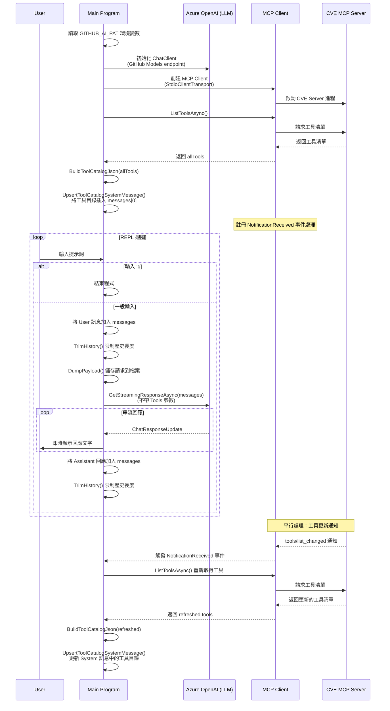

# MCP sample - CVE

## Sequence digram



## Client

1. Apply **Personal Access Tokens (Classic)** in the GitHub.
2. Set the environment variable **GITHUB_AI_PAT** to the secret token:
```bash
export GITHUB_AI_PAT="<Secret>"
```
3. Run the client with `dotnet run`. The client will list available tools, then prompt the user for input.

```
dotnet run
Available tools:
get_cve_summary
get_cve_projects
get_cve_list2
download_cve_solution
get_cve_groups2
get_cve_vender_list
get_cvss_vector
get_cve_severity
get_cve_info
is_cve_downloadable
get_cve_groups
get_cvss_score
get_cve_vender_list2
get_cve_solutions
get_cve_project_versions
get_cve_relationships
get_cve_list

Prompt:  Input you prompt...
```


## Server